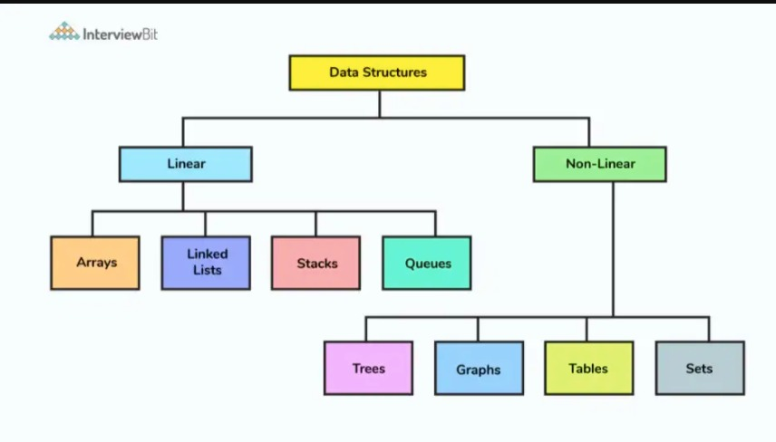

# Data Structures

* Data Structures are the most important concept of the computer science. When we learned the data structures, we can keep all kinds of data in ram and play on the memory.
* When we use the data structures, we need to pay  attention to some conditions. 
* ORDER : Sometimes data need to be ordered sometimes It's need to be randomly distrubuted.
* DUPLICATE : Sometimes we want that data is must be unique.
* SPEED : Different data structures has different speed for different transactions like Insert, delete, reach. We need to be careful to use data tructures when dealing with big data.
* MEMORY : Some data structures take up more memory than others.
* We need to learn data structures to figure out which structure to use in which situation, which is the best practice.



# Linked List
1. In java It is a dynamic collections. It's elements are keeped that linked each other. It holds two data in one area. First one is data or value, second one is reference of the the next data that come after itself.

2. Head is the pointer that include the reference of the first elements.

* Main advantage is inserting and removing elements in the middle of alist are quick. 

3. In java, We can create Linked List and its variants like this using the Collections:

```java
  LinkedList<Object> myList = new LinkedList<Object>();
  LinkedList<Object> myList = new ArrayList<Object>();
```
* So, If I wanted insert or remove lots of elements in the middle of the list Linked List would be faster than Array List, However If I wanted to get elemnts from the list Array List would be faster.
* Linked List also take up more memory than Array List. Because each elements on the Linked List hold references to the next and previous elements of the list in java collections.

# Doubly Linked List
1. In doubly linked list, Node has data and references to next node and previous node.You can iterate over linkedlist either in forward or backward direction as it has references to prev node and next node. 
2. Doubly Linked List need to be sequential access. We can move forward or backward on the list.


# Stack
1. It is a linear data structure that adopts LIFO behavior. 
2. In a stack data structure, It is not possible to access the intermediate elements. Accessing the elements of Stack is possible from top to the bottom. The elements are added and subtracted from only last element that known as top.


* Stack data structure is used in as balancing parentheses in code editor, backtracking algorithm in Deep Learning( to calculate computation has to go back in reverse order.) , in compilers, browsers (The back button in a browser saves all the URLs you have visited previously in a stack.)

# Queue
1. According to the order of arrival of the information, the list structure that is accessed first to the element that comes first is called a Queue.
2. Queue adopts FIFO (First in First Out) behavior.
3. In a Queue data structure, data is accessed from two ends. Adding (enqueue) elements from one end and removing (dequeueing) elements from the other end are done.


* Queue is used in many areas especially in computer science.(CPU, Disk Scheduling, when we send messages to our friends and they don’t have an internet connection then these messages are queued on the server of WhatsApp.)
# Tree
1. Tree is a non-linear, hierarchical data structures. Other (Linear Data Structures such as Queue, Stack, LinkedList) data structures store data in order. Therefore time complexity increses with the data size. Today, the speed is one of the most important skills for every program. Tree gives us that. Tree allow quicker and access to data.
2. Tree consists of a nodes and edges. 
   ->  Node contains a key or value and pointer to its child nodes.
   ->  It'is the link between two nodes.
   ->  Root : Topmost node of the tree.
   


* Nowadays, Tree data structures used  in many fields.Such as file systems on the computer, indexing database.

## Types Of Trees
Tree types most commonly used in computer science.
1. Binary Tree
2. Binary Search Tree
3. AVL Tree
4. B-Tree


